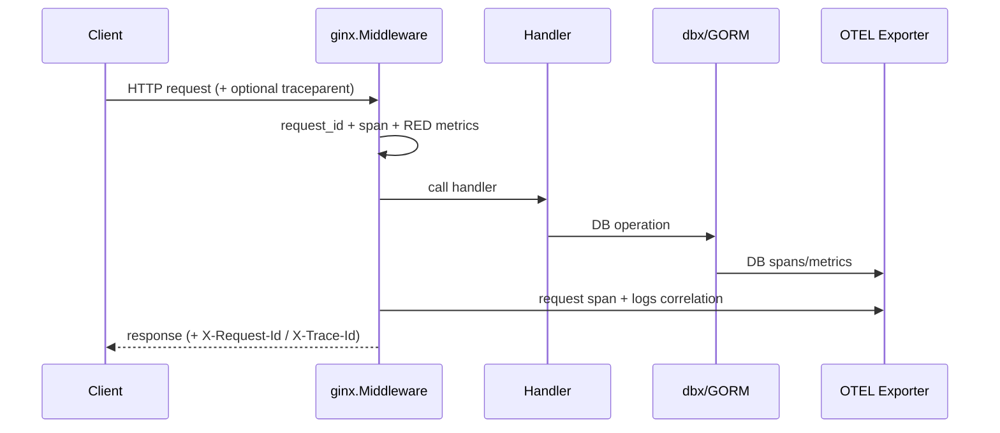
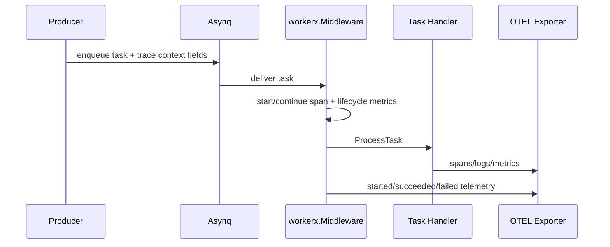
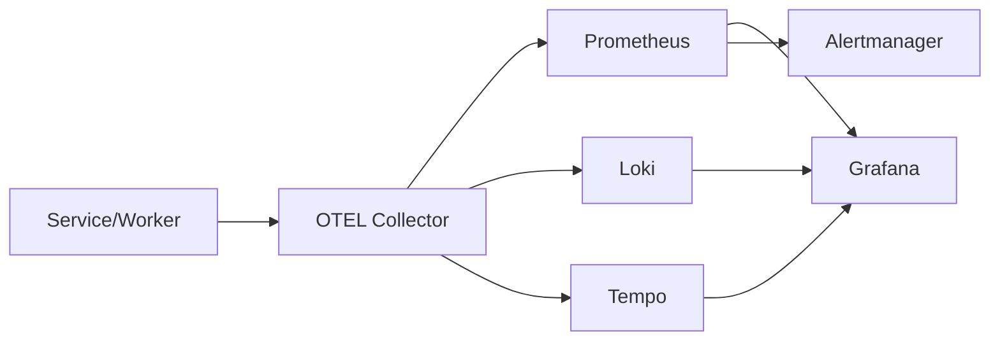

# Developer Understanding Guide

## Goal
Help developers understand how this repository is organized, how telemetry flows, and where to make changes safely.

## Repository Map
1. `module/`: reusable Go observability kit for services.
2. `platform/`: LGTM stack configs and provisioning.
3. `alerts/`: Prometheus alert rules and tests.
4. `dashboards/`: Grafana dashboard JSON and provisioning.
5. `examples/`: working integration sample.
6. `scripts/`: validation and policy gates.
7. `docs/`: specs, requirements, ADRs, migration, runbooks, releases.

## How Things Work

### A. HTTP Request Flow


### B. Worker Job Flow


### C. Platform Signal Routing


## Engineering Rules That Matter Most
1. Keep module APIs stable.
2. No high-cardinality labels.
3. Telemetry failures must degrade gracefully.
4. Blocking operations must honor context deadlines.
5. Docs-first for significant behavior/policy changes.

## Where to Edit for Common Tasks
1. HTTP telemetry behavior: `module/ginx/`.
2. Worker telemetry behavior: `module/workerx/`.
3. DB telemetry behavior: `module/dbx/`.
4. Readiness/liveness behavior: `module/health/`.
5. Collector routing: `platform/otel-collector/`.
6. Alerts: `alerts/prometheus/baseline.rules.yml` and `alerts/tests/`.
7. CI/policy gates: `.github/workflows/` and `scripts/`.

## Change Flow (Recommended)
1. Update docs contract if behavior/policy changes:
   1. `docs/spec.md`
   2. `docs/requirements.md`
   3. ADR if needed
2. Implement code change.
3. Add/adjust tests.
4. Run validation:
```bash
./scripts/test-race.sh
make lint
make test
make smoke
```
5. Add release note in `docs/releases/`.

## Troubleshooting Flow
1. Alert fires.
2. Check dashboard (`service`, `env`).
3. Identify failing route/queue/task.
4. Correlate logs and traces by `trace_id`.
5. Confirm dependency state with `/readyz` and DB/queue telemetry.
6. Apply mitigation and watch alert clear over its `for` window.
